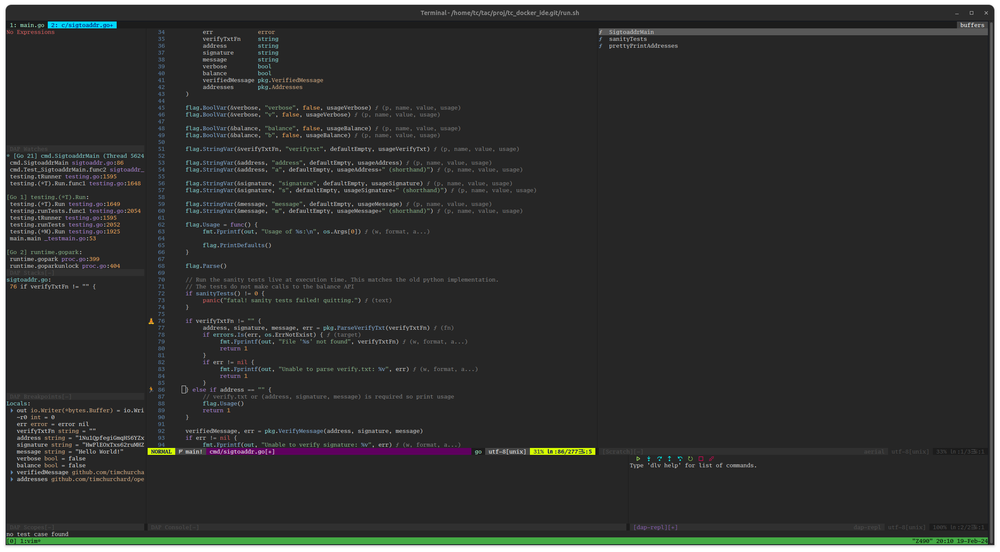

# docker-ide

Portable IDE for golang with neovim, tmux, &amp; zsh in docker.

Based on [ubuntu](https://hub.docker.com/_/ubuntu) docker image. Extra tools:
- [aws cli v2](https://github.com/aws/aws-cli/tree/v2)
- [terraform](https://www.terraform.io/) (1.4.5) and [terragrunt](https://terragrunt.gruntwork.io/) v0.45.4
- github [cli](https://github.com/cli/cli) (gh)

**Note** I built a docker image full of useful tools and setup for me. I do not care about size. Be aware the build and final image is large.

See [Cheatsheet](./CHEATSHEET.md) for keys



## Build

`docker build -t timchurchard/ide .`

## Run

Run the docker container and mount the project to edit onto /workspace.  The entrypoint.sh will attempt to update the built-in user to match the host UID/GID.  The entrypoint will also set git user/pass.  Also it may be convenient to mount ~/.ssh as the openssh-client is installed.

This container is intended to be long-running, the entrypoint is `tmux`.

```shell
docker run -it --rm \
    -v $(pwd):/workspace \
    -v ~/.ssh:/home/ubuntu/.ssh \
    -v ~/.$(whoami).env:/home/ubuntu/.env \
    -e HOST_USER_ID=$(id -u $USER) \
    -e HOST_GROUP_ID=$(id -g $USER) \
    -e GIT_USER_NAME="My Name" \
    -e GIT_USER_EMAIL="me@email.com" \
    timchurchard/ide
```

### tmux

tmux is using ctrl+h and vim mode eg ctrl+h h j k l to move between splits.  ctrl+h | or - to split V or H.  ctrl+h H J K L to resize.

### neovim

Neovim 0.9 is installed with vim-sensible so search with / and gruvbox dark default colorscheme.  .vim-tmp is written to each /workspace for my sanity.

Nerdtree built in using ctrl+n to toggle.

Fugitive using :G and :Git

vim-go is installed with [gofumpt](https://github.com/mvdan/gofumpt) as the default formatter.

### golang

go 1.21.7 is installed with related tools like [golangci-lint](https://github.com/golangci/golangci-lint) and [delve](https://github.com/go-delve/delve.

### other

- [rexi](https://github.com/royreznik/rexi) CLI tool for testing regex
